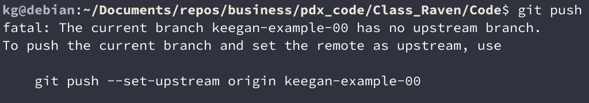
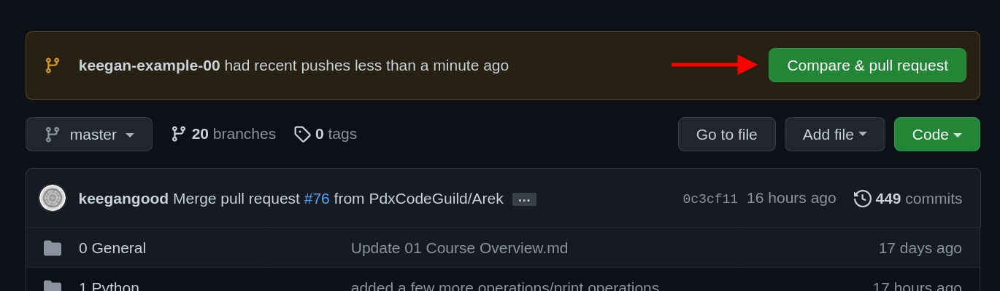
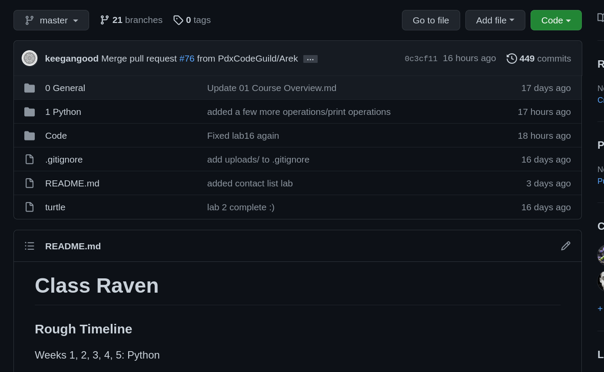
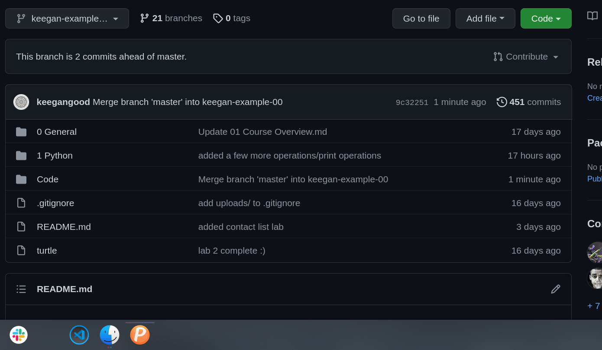
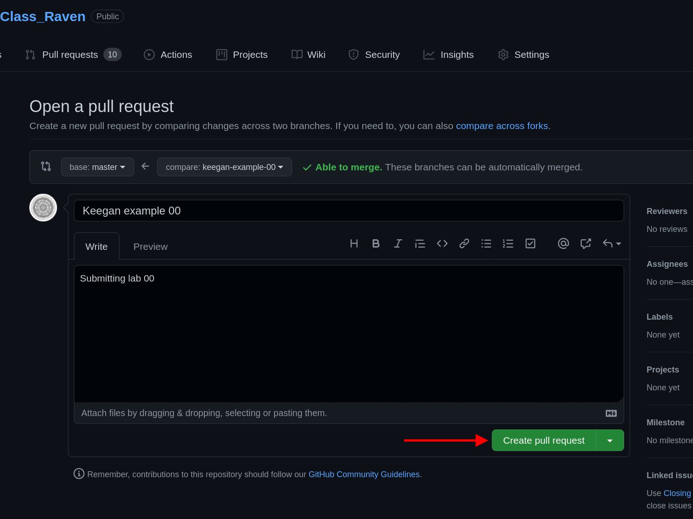
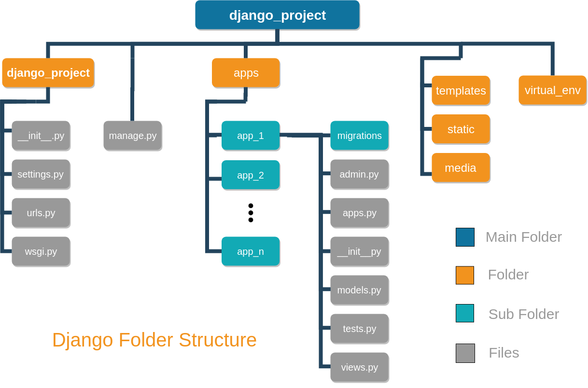

# Class Liger

Instructor:

Keegan Good

keegan@pdxcodeguild.com

### Rough Timeline

Weeks 1, 2, 3, 4, 5: Python

Weeks 6, 7: HTML/CSS/Flask

Weeks 8, 9, 10, 11: Django

**Weeks 12, 13, 14, 15: Javascript**

Weeks 16, 17, 18: Capstone project

### Scheduled Holidays (no class)

### Assigned Labs:

  
Python

| Lab Number | Title                                                                            | Due Date |
| ---------- | -------------------------------------------------------------------------------- | -------- |
| Lab 02a    | <a href="1 Python/labs/02a Mad Lib.md">Madlib</a>                                | 03/15    |
| Lab 02b    | <a href="1 Python/labs/02b Make Change.md">Make Change</a>                       | 03/16    |
| Lab 03b    | <a href="1 Python/labs/03b AverageNum.md">Average Number</a>                     | 03/17    |
| Lab 05     | <a href="1 Python/labs/05 Palindrome Checker.md">Palindrome Checker</a>          | 03/18    |
| Lab 06b    | <a href="1 Python/labs/06b Credit Card Validation.md">Credit Card Validation</a> | 03/21    |
| Lab 07     | <a href="1 Python/labs/07 Peaks and Valleys.md">Peaks and Valleys</a>            | 03/23    |
| Lab 08     | <a href="1 Python/labs/08 Pick6.md">Pick 6</a>                                   | 03/25    |
| Lab 09     | <a href="1 Python/labs/09 Blackjack Advice.md">Blackjack Advice</a>              | 03/28    |
| Lab 10     | <a href="1 Python/labs/10 Dad Joke API.md">Dad Joke API</a>                      | 03/29    |
| Lab 11     | <a href="1 Python/labs/11 Rot Cipher.md">Rot 13</a>                              | 03/31    |
| Lab 14     | <a href="1 Python/labs/14 ATM.md">ATM</a>                                        | 04/04    |
| Lab 17     | <a href="1 Python/labs/17 Contact List.md">Contact List</a>                      | 04/06    |
| N/A        | <a href="1 Python/labs/MiniCapstone.md">Mini Capstone</a>                        | 04/01    |

  
HTML/CSS/Flask

| Lab Number | Title                                                                               | Due Date |
| ---------- | ----------------------------------------------------------------------------------- | -------- |
| 01         | <a href="2 Flask + HTML + CSS\labs\01 Bio.md">Bio</a>                               | 04/19    |
| 02         | <a href="2 Flask + HTML + CSS\labs\02 Blog.md">Blog</a>                             | 04/20    |
| 03         | <a href="2 Flask + HTML + CSS\labs\03 Company.md">Company Home</a>                  | 04/22    |
| 04         | <a href="2 Flask + HTML + CSS\labs\04 Personal Portfolio.md">Personal Portfolio</a> | 04/22    |
| 05         | <a href="2 Flask + HTML + CSS\labs\05 Burrito Order Form.md">Burrito Order Form</a> | 04/28    |

  
Django

| Lab Number | Title                                                     | Due Date |
| ---------- | --------------------------------------------------------- | -------- |
| 01         | <a href="3 Django/labs/01 Todo.md">To Do List</a>         | 05/09    |
| 02         | <a href="3 Django/labs/02 Blog.md">Blog</a>               | 05/14    |
| 03         | <a href="3 Django/labs/Pokedex/03 Pokedex.md">Pokedex</a> | 05/24    |

  
JavaScript

| Lab Number      | Title                                                     | Due Date |
| --------------- | --------------------------------------------------------- | -------- |
| 01 - 03         |  | 06/02    |

## Submitting your work

Make sure all labs are located within `class_liger/code/<YOUR_NAME>`, where `<YOUR_NAME>` is your first name in all lowercase letters.

To emulate a more professional Git workflow, we're going to start creating new branches for each lab starting in the HTML/CSS section.

<h2>Creating a new branch:</h2>

Click to expand

- `git branch` to check that you're on the main branch, use `git checkout main` to go to the main branch if needed.

- `git status` to check if your local main branch is up to date with origin/main on Github.
- `git pull` if needed to pull any recent changes to your local repository

- Create a new branch and switch to it.

  - Option 1:

    - `git branch <YOUR_NAME-SECTION-LAB_NUMBER>`
    - `git checkout <YOUR_NAME-SECTION-LAB_NUMBER>`

  - Option 2:

    The `-b` flag can be used after the `checkout` command to combine these two steps:

    `git checkout -b <YOUR_NAME-SECTION-LAB_NUMBER>`

  **e.g.** My branch for the **"Lab 01 - Bio"** in the **HTML/CSS** section would be named: `keegan-htmlcss-lab01`. The name can vary a bit from this example, but please keep the chosen formatting consistent from one lab to another.

- `git add <FILENAME>` to add a specific file or `git add .` to add everything in the current dicrectory
- `git commit -m "your commit message"` to commit your work

- A remote branch will need to be created for each new local branch. Git will usually display the proper command to do this when a new branch is pushed for the first time.

  The command is:

  `git push --set-upstream origin <BRANCH_NAME>`

  **OR**

  `git push -u origin <BRANCH_NAME>`

  

    
Screenshot

    
  

- After successfully pushing your new branch to Github, you should see the option to create a Pull Request for your branch on the main repo page.

  

    
Screenshot

    
  

- If you don't see that message, you'll have to navigate to your new remote branch
  

    
Screenshot

    
  

- Once you've navigated to your individual branch, you'll find the option to create a Pull Request in the "Contribute" dropdown.
  

    
Screenshot

    
  

- Click the "Open Pull Request" button. Add a comment to your Pull Request like "Submitting Lab 00" and click "Create Pull request"
  

    
Screenshot

    
  

## Updating a branch

Click to expand

After a Pull Request is submitted, the code on that branch will be checked.

Necessary corrections or adjustments will be posted as comments on the Pull Request on Github and the Pull Request will be closed. When the corrections are made, submit the Pull Request again for checking.

Corrections will be made only to that particular branch.

- `git checkout <YOUR_NAME-SECTION-LAB_NUMBER>`

- Add and commit updated files.

- `git push` to push your changes up to the remote repository on GitHub

- Only one Pull Request is allowed per branch.

  - If a Pull Request is already open for the branch, a message will be added to the current Pull Request for the new commits.
  - If a Pull Request is not already open for the branch a new Pull Request will need to be created.

- Once a lab is complete, its branch will be merged into the `main` branch.

---

## Additional Resources

Python

<ul>
<li><a href="https://pep8.org/">Python Style Guide (PEP8)</a></li>
<li><a href="https://peps.python.org/pep-0020/">The Zen of Python (PEP20)</a></li>
</ul>

Data

<ul>
<li><a href="https://corgis-edu.github.io/corgis/json/">CORGIS: The Collection of Really Great, Interesting, Situated Datasets</a></li>
</ul>

Regex

<ul>
<li><a href="https://www.regex101.com/">Regex101.com</a> - Explore regular expressions and save useful patterns for later</li>
<li><a href="https://learngitbranching.js.org/?locale=en_US">Learn Git Branching Game</a></li>
<li><a href="https://www.youtube.com/watch?v=sa-TUpSx1JA">Corey Schafer - Regex</a></li>
</ul>

General

<ul>
<li><a href="https://medium.com/@JeffLombardJr/for-new-devs-how-to-ask-intelligent-questions-be1c70a0128f">How to Ask Intelligent Questions as a New Developer</a></li>
<li><a href="https://github.com/PdxCodeGuild/Programming101/tree/master/docs/flowcharts">Flowcharts</a></li>
<li><a href="https://code.visualstudio.com/shortcuts/keyboard-shortcuts-windows.pdf">VS Code Keyboard Shortcuts - Windows</a></li>
<li><a href="https://code.visualstudio.com/shortcuts/keyboard-shortcuts-macos.pdf">VS Code Keyboard Shortcuts - Mac</a></li>
<li><a href="https://codepen.io">Codepen</a></li>
</ul>

Git

<ul>
<li><a href="https://juristr.com/blog/2013/04/git-explained/">Git Explained: For Beginners</a></li>
<li><a href="https://learngitbranching.js.org/?locale=en_US">Learn Git Branching Game</a></li>
</ul>

CSS/HTML/FLASK

<ul>
<li><a href="https://css-tricks.com/snippets/css/a-guide-to-flexbox/">A Guide to Flexbox</a></li>
<li><a href="https://www.w3schools.com/css/">w3schools CSS</a></li>
<li><a href="https://www.w3schools.com/html/">w3schools HTML</a></li>
<li><a href="https://flukeout.github.io/">CSS Diner game</a></li>
<li><a href="https://flexboxfroggy.com/">Flexbox Froggy game</a></li>
<li><a href="https://codingfantasy.com/games/flexboxadventure">Flexbox Adventure game</a></li>
<li><a href="http://coolors.co/">coolors.co Color Picker</a></li>
<li><a href="http://color.adobe.com/">Adobe.com Color Picker</a></li>
</ul>

  
Django

  <ul>
  <li>
    

      
Folder Structure

      

      
      

    

    </li>
    <li><a href="https://peps.python.org/pep-3333/">PEP3333 - WSGI - Web Server Gateway Interface</a></li>
    <li><a href="https://github.com/perennialAutodidact/django_guides/blob/master/custom_user_model.md">Keegan's Quick Start and User Model guide</a></li>
    </ul>

  
JavaScript

  <ul>
    <li><a href="https://marketplace.visualstudio.com/items?itemName=xabikos.JavaScriptSnippets">JavaScript snippets for VS Code</a>
    </li>

